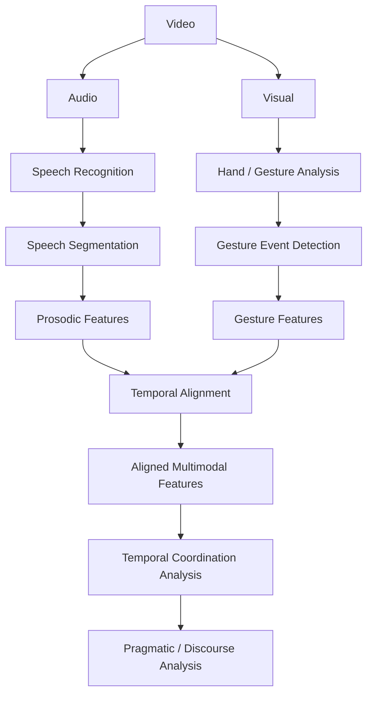

# multimodal-chinese-speech-analysis

An end-to-end computational pipeline for multimodal analysis of spontaneous Chinese speech, integrating automatic speech recognition, prosodic analysis, co-speech gesture processing, temporal alignment, and exploratory speech–gesture coordination analysis.

This repository contains computational work developed as part of my Master's research in Computational Linguistics at Saint Petersburg State University.

The project investigates spontaneous spoken Chinese from a multimodal perspective, combining linguistic content, prosodic signals, and co-speech gestures to study how communicative information is distributed across modalities and coordinated over time.

The repository is an ongoing research project. The current implementation provides a working proof-of-concept pipeline, while subsequent stages will extend the analysis to manually annotated multimodal data and learned representations.

## Research Focus

### Current Focus

The current research focuses on:

* spontaneous Chinese speech
* speech and language processing
* prosodic analysis
* co-speech gesture analysis
* speech–gesture temporal coordination
* multimodal speech representation

### Longer-Term Directions

The broader research agenda includes:

* linguistically motivated gesture annotation and classification
* multimodal representation learning
* pragmatic and discourse analysis
* integration of linguistic structure with acoustic and visual signals

The central research goal is to move beyond treating speech as a purely textual or acoustic signal and investigate how linguistic, prosodic, and visual information jointly contribute to meaning in spontaneous communication.

## Current Demonstration

The current end-to-end prototype has been tested on one spontaneous Chinese speech video.

It demonstrates the extraction and temporal integration of three main modalities:

* speech content
* prosodic information
* co-speech hand movement

The current proof-of-concept contains:

* 1,846 video frames at 30 FPS
* 124 prosodic temporal windows
* 10 ASR segments
* 17 aligned multimodal features
* exploratory F0–gesture lag analysis
* event-based temporal matching

The current analysis is exploratory and is intended to validate the computational pipeline before scaling the analysis to a larger multimodal dataset.

## Research Pipeline

The current computational pipeline follows this workflow:



The pipeline integrates speech, prosodic, and visual information on a shared temporal axis.

## Results

The current prototype includes exploratory visualization of multimodal temporal patterns.

### 1. Temporal Profile

Shows the temporal variation of F0, intensity, and wrist movement on a shared timeline.


### 2. F0–Gesture Lag Profile

Shows the lagged relationship between F0 and wrist movement across different temporal offsets.


### 3. Event-Level Lag Distribution

Shows the distribution of temporal differences between matched F0 and wrist movement events.


### 4. Event-Based Temporal Matching

Shows one-to-one matching between detected F0 and wrist movement events.


These results are exploratory and are based on a single spontaneous Chinese speech video. They are intended to demonstrate the analytical workflow rather than establish generalizable statistical effects.

## Computational Components

### 1. Speech Processing

The speech component currently includes:

* Chinese automatic speech recognition
* speech segmentation
* transcript processing
* temporal alignment of speech segments

The current prototype uses Whisper-based automatic transcription.

### 2. Prosodic Analysis

The current prototype extracts acoustic features including:

* fundamental frequency (F0)
* intensity
* segment-level variability of prosodic measures

Prosodic features are extracted over short temporal windows and aggregated for aligned speech segments.

### 3. Gesture Analysis

The visual component focuses on co-speech hand movement.

Current computational experiments include:

* hand landmark detection
* wrist movement tracking
* movement-based gesture event detection
* temporal alignment between gesture movement and speech

The current gesture component is a prototype based on movement features. Linguistically motivated gesture categories, manual annotation, and supervised gesture classification are planned for later stages.

### 4. Multimodal Alignment

A central component of the project is the temporal integration of speech, prosodic, and visual information.

The current prototype aligns:

* speech transcripts
* speech timestamps
* F0 features
* intensity features
* wrist movement features
* speech–gesture temporal relationships

This provides a basis for exploratory analysis of how multimodal signals coordinate over time.

## Tools and Technologies

### Current Prototype

#### Programming and Data Analysis

* Python
* NumPy
* Pandas
* SciPy
* Scikit-learn
* Matplotlib

#### Speech and Audio Processing

* Whisper
* Praat
* Librosa

#### Visual Processing

* MediaPipe
* OpenCV

#### Deep Learning

* PyTorch

### Research Extensions

The broader research workflow may additionally involve:

* Hugging Face Transformers
* Universal Dependencies
* Stanza
* UDPipe
* ELAN
* CLIP
* Vision Transformers

These tools support subsequent work on linguistic structure, annotation, multimodal representation learning, and probing.

## Research Data

The research focuses on spontaneous spoken Chinese and audiovisual data suitable for multimodal analysis.

The current public demonstration uses one spontaneous Chinese speech video to validate the end-to-end processing pipeline.

Raw participant audio and video are not included in the public repository because the underlying recordings may contain personally identifiable information and human-subject data.

Publicly shareable materials are limited to code, documentation, derived non-sensitive examples, and other appropriate demonstration materials.

## Repository Structure

```text
multimodal-chinese-speech-analysis/
│
├── src/
│   ├── asr.py
│   ├── prosody.py
│   ├── gesture.py
│   ├── align.py
│   └── pipeline.py
│
├── notebooks/
│   └── 01_end_to_end_demo.ipynb
│
├── docs/
│   └── annotation_scheme.md
│
├── requirements.txt
├── README.md
└── .gitignore
```

## Current Status

The current end-to-end prototype provides a working computational workflow from raw audiovisual input to exploratory multimodal analysis.

Implemented components include:

* Chinese ASR
* prosodic feature extraction
* wrist movement extraction
* temporal alignment
* multimodal feature construction
* data quality checks
* feature normalization
* exploratory temporal coordination analysis
* event-based speech–gesture matching
* multimodal visualization

The current implementation is a proof-of-concept and is being used to validate the computational methodology before larger-scale dataset construction and modeling.

## Limitations and Next Steps

The current demonstration is based on a single spontaneous Chinese speech video. The temporal coordination analyses are therefore exploratory and should not be interpreted as evidence of generalizable effects.

The next stages of the project will focus on:

* expanding the analysis to a larger multimodal dataset
* developing and validating a linguistically motivated gesture annotation scheme
* manually annotating gesture units and communicative functions
* improving gesture event segmentation and classification
* evaluating speech–gesture temporal coordination across speakers and contexts
* integrating linguistic structure with acoustic and visual signals
* developing multimodal representation learning and probing methods

## Annotation Framework

The planned manual annotation framework is documented in:

[`docs/annotation_scheme.md`](docs/annotation_scheme.md)

The annotation scheme is intended to connect automatically extracted multimodal features with linguistically and communicatively motivated labels, including gesture type, speech–gesture temporal relation, and pragmatic or discourse function.

## Research Motivation

Spontaneous communication is inherently multimodal. Speakers coordinate lexical, syntactic, prosodic, and visual signals rather than producing language through speech alone.

This project therefore treats speech, prosody, and gesture as complementary sources of communicative information and investigates how these signals can be represented and analyzed computationally.

The broader research goal is to develop computational approaches for understanding multimodal meaning and pragmatic information in natural communication.

## About

Xuanyu Zhang
M.S. Computational Linguistics
Saint Petersburg State University

Research interests:

Computational Linguistics · Multimodal NLP · Speech Processing · Gesture Analysis · Pragmatics · Multimodal Representation Learning

## Note

This repository represents ongoing academic research. Some components are experimental prototypes and may change as the research methodology, annotation framework, and modeling strategy develop.
